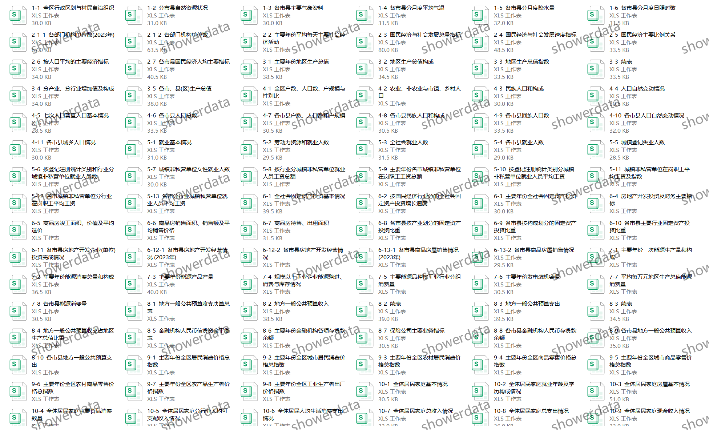
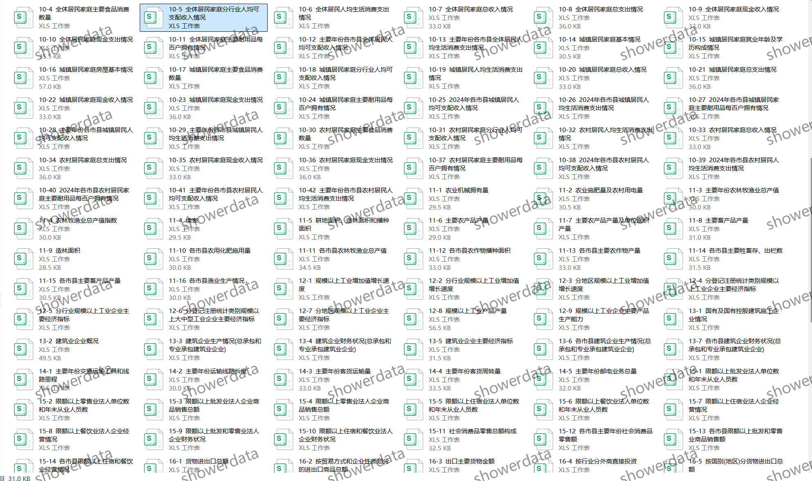
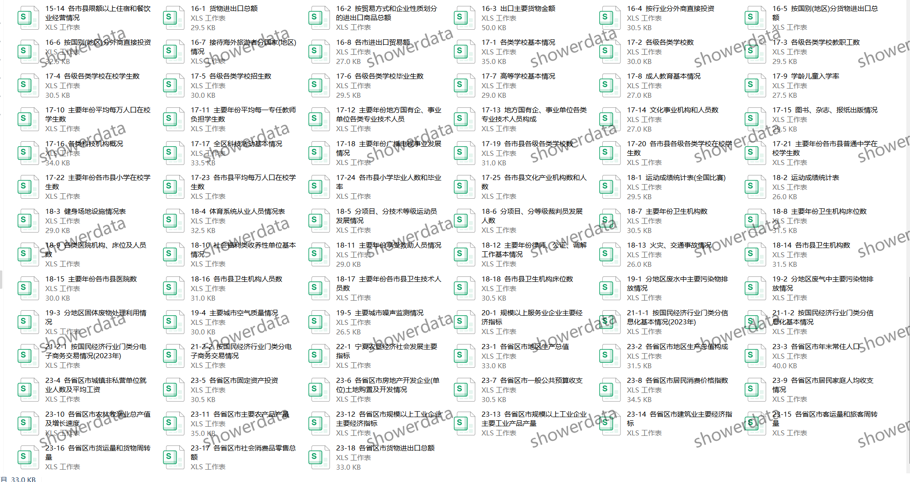
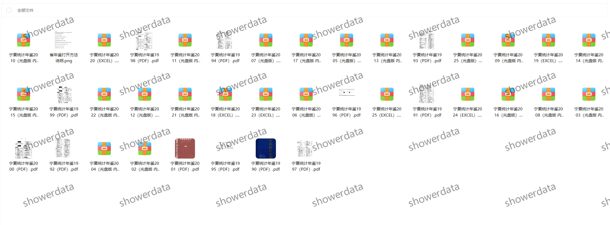

## Body

**Ningxia Statistical Yearbook (1985-2025)**

**Data Introduction:**
The Ningxia Statistical Yearbook

**Indicator Details:**
The catalog is displayed in the image for reference. The actual content of the yearbook should be considered. Please view it on your own and make an informed purchase. If you need assistance finding data, all information is here. After shipment, returns without reason are not supported.
The display catalog is in Excel format for 2025. The statistical methods may vary from year to year. For academic purposes, please be aware.

**Data Format:**
The format is somewhat disorganized, with some being PDFs, others being Excel files, some being CD versions, and some requiring a reader to open. Please refer to the images within the folder for specific details. If you have any concerns, please do not proceed; proceeding will result in no refund!

## Images

item_1069003554441

Here is a pay link on Stripe ( https://buy.stripe.com/3cs8yP7sY87d0vu9AB ). Please contact me lonlonago@foxmail.com after funding $89, and I will send you a complete data files , thank you!

